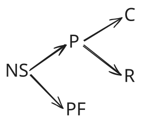
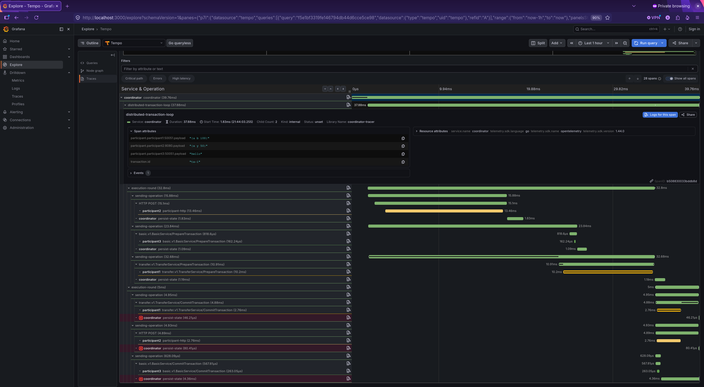

# twopc

[](https://pkg.go.dev/github.com/mat-sik/two-phase-commit-go/twopc@v1.1.1)
[](https://github.com/mat-sik/two-phase-commit-go/actions)
[](https://github.com/mat-sik/two-phase-commit-go/blob/main/LICENSE)

A simple-to-use two phase commit library, that is highly flexible. It works with any synchronous communication between
coordinator and transaction participants. It can use any preferred method (or none) of persisting transaction state
in case coordinator dies.

The library has OTel traces instrumentation implemented.

## Table of contents

- [Docs](#docs)
- [Installation](#installation)
- [Quick start](#quick-start)
    - [Configuration options](#configuration-options)
    - [Example implementations](#example-implementations)
    - [Runnable example](#runnable-example)
- [Guarantees](#guarantees)
- [State transitions](#state-transitions)
- [OTel](#otel)
- [Tests](#tests)

## Docs

Package docs can be found on [`pkg.go.dev`](https://pkg.go.dev/github.com/mat-sik/two-phase-commit-go/twopc@v1.1.1)

## Installation

```bash
go get github.com/mat-sik/two-phase-commit-go/twopc@v1.1.1
```

Requires Go 1.26.2 or later.

## Quick start

A minimal setup needs three interface implementations:

- [`TransactionStateChecker`](https://github.com/mat-sik/two-phase-commit-go/blob/main/twopc/contract.go#L17) -
  reports current per-participant transaction state so the coordinator can resume after a crash.
- [`TransactionStatePersister`](https://github.com/mat-sik/two-phase-commit-go/blob/main/twopc/contract.go#L95) -
  durably records state transitions as they happen, asynchronously to coordinator work.
- [`Client`](https://github.com/mat-sik/two-phase-commit-go/blob/main/twopc/contract.go#L135) (used for each
  participant) - issues prepare/commit/rollback operations to a participant; implementations must be idempotent
  (see [Guarantees](#guarantees)).

`ID` is a generic type parameter for however you identify participants (a string
address, a UUID, etc.) - this example uses `string`.

```go
package main

import (
	"context"
	"fmt"

	"github.com/mat-sik/two-phase-commit-go/twopc"
)

func main() {
	ctx := context.Background()

	persistenceConfig := twopc.PersistenceConfig[string]{
		TransactionStateChecker:   myStateChecker,   // implements twopc.TransactionStateChecker[string]
		TransactionStatePersister: myStatePersister, // implements twopc.TransactionStatePersister[string]
	}

	clientConfig := twopc.ClientConfig[string]{
		Clients: map[string]twopc.Client{
			"participant1:50051": myClient1, // implements twopc.Client
			"participant2:8080":  myClient2,
		},
		// NewClientFunc can be set instead of/alongside Clients to lazily
		// construct a client for participant IDs not already in the map.
	}

	coordinator := twopc.NewCoordinator(persistenceConfig, clientConfig)

	tx := twopc.DistributedTransaction[string]{
		TransactionID: "tx-1",
		Transactions: []twopc.Transaction[string]{
			{ParticipantID: "participant1:50051", Payload: myPayload1}, // implements twopc.PreparePayload
			{ParticipantID: "participant2:8080", Payload: myPayload2},
		},
	}

	result := coordinator.Execute(ctx, tx)

	switch result.Outcome() {
	case twopc.OutcomeSuccess:
		fmt.Println("transaction committed successfully")
	case twopc.OutcomeFailed:
		fmt.Println("transaction failed cleanly; all participants are in a consistent, safe state")
	case twopc.OutcomeInconsistent:
		fmt.Println("inconsistent: retry Execute with the same TransactionID")
	}

	if err := result.Err(); err != nil {
		fmt.Println("errors encountered during execution:", err)
	}
}
```

If `Execute` returns `OutcomeInconsistent`, call `Execute` again with the same `TransactionID` (and the same or
an equivalent `DistributedTransaction`) - the coordinator reloads persisted state and resumes from where it left
off. See [Guarantees](#Guarantees).

A non-nil `result.Err()` doesn't necessarily mean the transaction is in a bad state - it may just carry transient
errors (e.g. a persistence hiccup) that occurred on the way to a clean `OutcomeSuccess` or `OutcomeFailed`. Always
check `Outcome()` first.

There is an [
`integration test`](https://github.com/mat-sik/two-phase-commit-go/blob/main/examples/test/postgres_persistence_test.go#L314)
that illustrates such situation

### Configuration options

`NewCoordinator` accepts functional options to tune retry/backoff behavior and wire up tracing:

| Option                        | Default     | Purpose                                                                                                                   |
|-------------------------------|-------------|---------------------------------------------------------------------------------------------------------------------------|
| `WithSendOperationTimeout(d)` | `5s`        | Per-attempt timeout for a single Prepare/Commit/Rollback call.                                                            |
| `WithBackoffBase(d)`          | `200ms`     | Initial backoff delay before retrying a failed participant.                                                               |
| `WithBackoffMax(d)`           | `10s`       | Ceiling on the exponential backoff delay.                                                                                 |
| `WithBackoffFactor(f)`        | `2`         | Growth factor applied to the backoff delay after each failure.                                                            |
| `WithOTelTracer(tracer)`      | noop tracer | Enables span emission for the transaction loop, rounds, per-participant operations, backoff waits, and async persistence. |

```go
coordinator := twopc.NewCoordinator(
    persistenceConfig,
    clientConfig,
    twopc.WithOTelTracer(myTracer),
    twopc.WithBackoffMax(30*time.Second),
)
```

### Example implementations

[
`TransactionStateChecker and TransactionStatePersister postgres implementation`](https://github.com/mat-sik/two-phase-commit-go/blob/main/examples/internal/coordinator/persister/postgres.go)
It uses this [
`DB schema`](https://github.com/mat-sik/two-phase-commit-go/blob/main/examples/db/coordinator/migrations/1_schema.sql)

[`REST client`](https://github.com/mat-sik/two-phase-commit-go/blob/main/examples/internal/coordinator/client/rest.go)

[
`gRPC client`](https://github.com/mat-sik/two-phase-commit-go/blob/main/examples/internal/coordinator/client/transfer/grpc.go)

### Runnable example

There is a [`docker compose`](https://github.com/mat-sik/two-phase-commit-go/blob/main/examples/docker-compose.yaml)
file with three participants, their databases, testing coordinator, its database and OTel lgtm.

The participants can be modified with the use of environment variables to test different communication methods (REST,
gRPC) as well as different business logic, one that uses postgres and another one that doesn't use database at all.

The coordinator operations are configured in the request.

config files that read the environment variables:

- [
  `coordinator and participantOTel config`](https://github.com/mat-sik/two-phase-commit-go/blob/main/examples/internal/config/collector.go)
- [
  `coordinator config`](https://github.com/mat-sik/two-phase-commit-go/blob/main/examples/internal/config/coordinator.go)
- [
  `participant config`](https://github.com/mat-sik/two-phase-commit-go/blob/main/examples/internal/config/participant.go)

Example of a request to the test coordinator

```json
{
  "id": "tx-1",
  "transactions": [
    {
      "participant_id": "participant1:50051",
      "protocol": "GRPC",
      "transfer_payload": {
        "sender_id": "a",
        "receiver_id": "b",
        "amount": 100
      }
    },
    {
      "participant_id": "participant2:8080",
      "protocol": "REST",
      "transfer_payload": {
        "sender_id": "x",
        "receiver_id": "y",
        "amount": 50
      }
    },
    {
      "participant_id": "participant3:50051",
      "protocol": "GRPC",
      "basic_payload": {
        "payload": "hello"
      }
    }
  ]
}
```

## Guarantees

In case the coordinator dies mid-transaction, each performed operation is persisted so that coordinator is able to
continue after coming back up to life. This means that the system is eventually consistent in case the coordinator or
any participant becomes unresponsive.

The transaction state is persisted asynchronously to the work of the coordinator. Persisting happens as quickly as
possible after successful participant transaction operation.

Because of failures of the system used for persistence or very unfortunate moment of the coordinator failure, for
example right after the operation is sent to the participant but before the result is persisted. The endpoints exposed
by the participants should be idempotent, to gracefully handle duplicated messages.

So for example if transaction has been already prepared, and the coordinator ask again to prepare the transaction, the
participant should respond with success. Similarly, with the commit or rollback operations.

## State transitions



Each participant state tracked by the coordinator can be either:

- not started
- prepared
- prepare failed
- committed
- rolled back

### Terminal states

Possible terminal states:

- all committed - successful outcome
- all not started, or prepare failed, or rolled back - failed outcome

Not started and prepare failed are safe states, because they shouldn't leave any transient state on the participants.

Only when we have some participant prepared waiting for final operations the state can be inconsistent.

### Outcomes

An outcome of the coordinator execute can be either:

- successful, a distributed transaction has been performed
- failed, a distributed transaction hasn't been performed, but the participants are left in consistent state
- inconsistent, when coordinator or any participant fails during commit or rollback phase, meaning there are prepared
  participants waiting

In case inconsistent outcome is returned, the coordinator execute should be retried with the same distributed
transaction struct, until the outcome is failed or successful. See [Guarantees](#Guarantees).

## OTel



To enable instrumentation, pass an OTel tracer to `NewCoordinator` via the
[`WithOTelTracer`](https://github.com/mat-sik/two-phase-commit-go/blob/main/twopc/config.go#L74) option (see
[Configuration options](#configuration-options)). By default, the coordinator uses a noop tracer, so instrumentation
adds no overhead unless explicitly enabled.

When enabled, spans are emitted for the full transaction lifecycle: the outer transaction loop, each execution
round, per-participant operations, backoff waits, and async state persistence.

To see participantID and payload values in trace attributes (rather than Go's default formatting), the underlying
`ID` type and `PreparePayload` concrete type should implement the `fmt.Stringer` interface.

## Tests

There are comprehensive [`integration`](https://github.com/mat-sik/two-phase-commit-go/tree/main/examples/test) tests

and unit tests of the following components:

- [`coordinator`](https://github.com/mat-sik/two-phase-commit-go/blob/main/twopc/coordinator_test.go)
- [`state`](https://github.com/mat-sik/two-phase-commit-go/blob/main/twopc/internal/state/state_test.go)
- [`state loader`](https://github.com/mat-sik/two-phase-commit-go/blob/main/twopc/internal/state/loader_test.go)